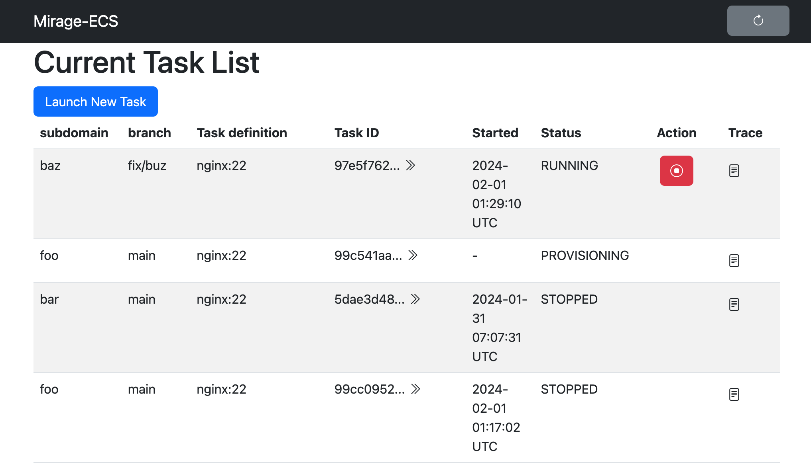
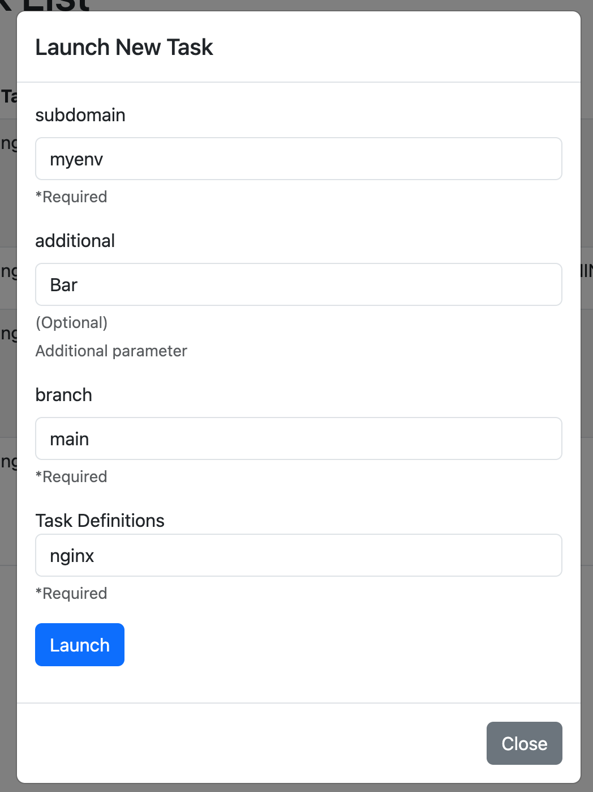

# mirage-ecs - reverse proxy frontend for Amazon ECS

mirage-ecs is reverse proxy for ECS task and task manager.

mirage-ecs can run and stop an ECS task and serve http request with specified subdomain. Additionaly, mirage passes variable to containers in task using environment variables.

## Usage

### Minimal Configuration

Set a single environment variable.

`MIRAGE_DOMAIN=.dev.example.net` (default is `.local`)

1. mirage-ecs accepts HTTP request on "https://mirage.dev.example.net".
2. Launch ECS task container specified subdomain by API or Web UI.
3. Now, you can access to the task using "https://<subdomain>.dev.exmaple.net/".

`*.dev.example.net` should be resolved to mirage-ecs webapi.

### Launch a mirage-ecs on ECS

mirage-ecs is designed to work as an ECS service deployed under an Application Load Balancer (ALB).

An example of terraform configuration for deploying mirage-ecs is [terraform/](terraform/).

An example of task definition of mirage-ecs is [ecs-task-def.json](ecs-task-def.json).

Requirements:
- `awsvpc` network mode.
- A public IP address or NAT Gateway or VPC endpoints to call AWS APIs.
- IAM Permissions to launch ECS tasks, and report metrics and get logs.
  - `iam:PassRole`
  - `ecs:RunTask`
  - `ecs:DescribeTasks`
  - `ecs:DescribeTaskDefinition`
  - `ecs:DescribeServices`
  - `ecs:StopTask`
  - `ecs:ListTasks`
  - `cloudwatch:PutMetricData`
  - `cloudwatch:GetMetricData`
  - `logs:GetLogEvents`
  - `route53:GetHostedZone` (optional for mirage link)
  - `route53:ChangeResourceRecordSets` (optional for mirage link)
  - `s3:GetObject` (optional for loading config/html files from S3)
  - `s3:ListBucket` (optional for loading html files from S3)

  See also [terraform/iam.tf](terraform/iam.tf).

### Using CLI

Launch an ECS task using curl.

```console
$ curl https://mirage.dev.example.net/api/launch \
  -d subdomain=cool-feature \
  -d branch=feature/cool \
  -d taskdef=myapp
```

Terminate the task using curl.

```console
$ curl https://mirage.dev.example.net/api/terminate \
  -d subdomain=cool-feature
```

`subdomain` supports wildcard (e.g. `www*`,`foo[0-9]`, `api-?-test`).

#### Specification of wildcard match

mirage-ecs supports wildcard in `subdomain` parameter.

Matches a pattern to hostname using Go's [path/#Match](https://golang.org/pkg/path/#Match).

If multiple tasks match the pattern, mirage-ecs prefer the task with the earliest launch time. Not a longest match. For example,

1. Launches a task with `subdomain=foo-*`.
2. Launches a task with `subdomain=foo-bar-*`.
3. Launches a task with `subdomain=*-baz`.

`foo-bar-baz` matches 1 and 2 and 3, but mirage-ecs prefer 1.

After `foo-*` is terminated, `foo-bar-baz` matches 2 and 3, but mirage-ecs prefer 2.

### Using Web Interface

1. Access to mirage web interface via "https://mirage.dev.example.net/".
1. Press "Launch New Task".
1. Fill launch options.
   - subdomain: cool-feature
   - branch: feature/cool
   - taskdef: myapp
1. Now, you can access to container using "https://cool-feature.dev.exmaple.net/".
1. Press "Terminate" button.






### Full Configuration

mirage-ecs can be configured by a config file.

Write a YAML file, and specify the file by the `-conf` CLI option or the `MIRAGE_CONF` environment variable.

mirage-ecs can load config file from S3 and local file. To load config file from S3, specify the S3 URL (e.g. `s3://example-bucket/config.yaml`) to the `MIRAGE_CONF` environment variable.

```console

The default configuration is same as below.

```yaml
host:
  webapi: mirage.local
  reverse_proxy_suffix: .local
listen:
  foreign_address: 0.0.0.0
  http:
    - listen: 80
      target: 80
network:
  proxy_timeout: 0
htmldir: ./html
parameters:
  - name: branch
    env: GIT_BRANCH
    rule: ""
    required: true
auth:
  token:
    header: x-mirage-token
    token: "{{ env `MIRAGE_TOKEN` }}"
  amzn_oidc:
    claim: email
    matcher:
      - suffix: "@example.com"
      - exact: "foo@example.net"
```

#### `host` section

`host` section configures hostname of mirage-ecs webapi and suffix of launched ECS task hostname.

```yaml
host:
  webapi: mirage.dev.example.net         # hostname of mirage-ecs webapi
  reverse_proxy_suffix: .dev.example.net # suffix of launched ECS task hostname
```

#### `listen` section

`listen` section configures port number of mirage-ecs webapi and target ECS task.

```yaml
listen:
  http:
    - listen: 80 # port number of mirage-ecs webapi
      target: 80 # port number of target ECS task
      require_auth_cookie: true # require auth cookie to access to target ECS task
```

When `require_auth_cookie` is true, mirage-ecs requires a cookie to access to target ECS task. mirage-ecs sets a cookie to the browser if authorized by other authentication methods. The cookie is used to authenticate the request to target ECS task. See also `cookie_secret` section in `auth` configuration.

When `require_auth_cookie` is false (default), mirage-ecs does not restrict access to target ECS task.

This configuration allows to specify multiple ports. mirage-ecs listens to all ports and proxies to the target ECS task.

```yaml
listen:
  http:
    - listen: 3000
      target: 3000
      require_auth_cookie: true
    - listen: 5000
      target: 5000
      require_auth_cookie: false
```

#### `network` section

`network` section configures network settings of mirage-ecs reverse proxy.

```yaml
network:
  proxy_timeout: 30s # timeout of reverse proxy
```

`proxy_timeout` default is 0 (means no timeout). If `proxy_timeout` is not 0, mirage-ecs timeouts the request to backends after the specified duration and returns HTTP status 504 (Gateway Timeout).

#### `parameters` section

`parameters` section configures parameters for launched ECS task for subdomains.

The default parameter "branch" as below.

```yaml
parameters:
  - name: branch
    env: GIT_BRANCH
    rule: ""
    required: true
```

You can add any custom parameters. "rule" option is regexp string.

These parameters are passed to ECS task as environment variables and tags of the task.

##### default value

A parameter can have a default value. The default value is used when the parameter is not specified.

```yaml
parameters:
  - name: foo
    env: FOO
    default: bar
```

##### regexp rule

A parameter can have a regexp rule. The rule is used to validate the parameter value.

```yaml
parameters:
  - name: foo
    env: FOO
    rule: "^[a-z]+$"
```

##### description

A parameter can have a description. The description is used to show the parameter in the web interface.

```yaml
parameters:
  - name: foo
    env: FOO
    description: "foo parameter"
```

##### required

A parameter can be required. If the parameter is required, mirage-ecs returns an error when the parameter is not specified.

This option can use with `default` option.

```yaml
parameters:
  - name: foo
    env: FOO
    required: true
```

##### options

A parameter defines selectable options. The options are used to create a select box in the web interface.

```yaml
parameters:
  - name: foo
    env: FOO
    options:
      - label: bar  # if label is not specified, use value
        value: bar
      - label: baz
        value: baz
```

#### `htmldir` section

`htmldir` section configures directory of mirage-ecs webapi template files.

See [html/](html/) directory for default template files. If you want to customize the web interface, copy the files to your directory and modify them.

Required files are below.

```
html
├── launcher.html
├── layout.html
└── list.html
```

`htmldir` allows to specify a directory path or a S3 URL.

```yaml
htmldir: s3://example-bucket/html/
```

When a s3 URL is specified, mirage-ecs loads template files from the S3 bucket at startup.

#### `ecs` section

mirage-ecs configures `ecs` section automatically based on the ECS service and task of itself.

- `region` is set to `AWS_REGION` enviroment variable.
- `cluster` and `network_configuration` is set to same as the ECS service.
- `launch_type` is set to `FARGATE`.
- `enable_execute_command` is set to `true`.
- `capacity_provider_strategy` is set to null.
  - If you want to use capacity provider, write the `ecs` section and remove `launch_type`.
- `default_task_definition` is not set.
  - Need to specify the task definition name when launching a task.

If you want to partially override the settings, write the `ecs` section.

```yaml
ecs:
  region: "ap-northeast-1"
  cluster: mycluster
  default_task_definition: myapp
  enable_execute_command: true
  launch_type: FARGATE
  network_configuration:
    awsvpc_configuration:
      subnets:
        - subnet-aaaa0000
        - subnet-bbbb1111
        - subnet-cccc2222
      security_groups:
        - sg-11112222
        - sg-aaaagggg
      assign_public_ip: ENABLED
```

#### `link` section

`link` section configures mirage link.

```yaml
link:
  hosted_zone_id: ZZZZZZZZZZZZZZ  # Route53 hosted zone ID
  default_task_definitions:
    - frontend-taskdef
    - backend-taskdef
```

See "mirage link" section for details.


#### `auth` section

`auth` section configures authentication to restrict access to webapi. The access via reverse proxy is not restricted by auth methods.

This section is optional.

mirage-ecs supports token authentication, basic authentication and Amazon OIDC authentication by Application Load Balancer. You can use multiple authentication methods at the same time.

If you configure multiple authentication methods, mirage-ecs checks the methods in order token, Amazon OIDC, and basic.  When some method succeeds, mirage-ecs allows access.

```yaml
auth:
  cookie_secret: "{{ env `MIRAGE_COOKIE_SECRET` }}"
  token:
    header: x-mirage-token
    token: "{{ env `MIRAGE_TOKEN` }}"
  amzn_oidc:
    claim: email
    matcher:
      - suffix: "@example.com"
      - exact: "foo@example.net"
  basic:
    username: mirage
    password: "{{ env `MIRAGE_PASSWORD` }}"
```

#### `cookie_secret` section

`cookie_secret` section configures secret key for cookie authentication.

When you configure `cookie_secret`, mirage-ecs sets a cookie to the browser after being authorized by other authentication methods. The cookie is used to authenticate the next request for webapi and reverse proxy to the target ECS tasks.

##### `token` section

`token` section configures token authentication. The token is passed by specfied HTTP header.

```yaml
auth:
  token:
    header: x-mirage-token
    token: foobarbaz
```

This configuration requires `x-mirage-token: foobarbaz` HTTP header to access mirage-ecs.

##### `basic` section

`basic` section configures HTTP Basic authentication.

```yaml
auth:
  basic:
    username: mirage
    password: foobarbaz
```

This configuration requires username and password to access mirage-ecs by Basic authentication.

##### `amzn_oidc` section

`amzn_oidc` section configures OIDC authentication by Application Load Balancer. See also [Authenticate users using an Application Load Balancer](https://docs.aws.amazon.com/elasticloadbalancing/latest/application/listener-authenticate-users.html)

```yaml
auth:
  amzn_oidc:
    claim: email
    matcher:
      - suffix: "@example.com"
      - exact: "foo@example.net"
```

When ALB passes an OIDC token, mirage-ecs validates the token and checks the claim value. If the claim value matches any matchers, mirage-ecs allows access.


## mirage link

mirage link feature enables to launch and terminate multiple tasks that have the same subdomain.

This feature helps launch so many containers that have the same subdomain. (A single ECS task can only have up to 10 containers)

mirage link works as below.
- Launch API launches multiple tasks that have the same subdomain.
  - `/api/launch` accepts multiple `taskdef` parameters for each tasks.
- mirage-ecs puts to DNS name of these tasks into Route53 hosted zone.
  -  e.g. `{container-name}.{subdomain}.{hosted-zone} A {tasks IP address}`

For example,
- hosted zone: `mirage.example.com``
- First task (IP address 10.1.0.1) has container `proxy`.
- Second task (IP address 10.2.0.2) has container `app`.
- Subdomain: `myenv`

mirage-ecs puts the following DNS records.
- `nginx.myenv.mirage.example.com A 10.1.0.1`
- `app.myenv.mirage.example.com A 10.2.0.2`

So the proxy container can connect to the app with the DNS name `app.myenv.mirage.example.com`.

To enable mirage link, define your Route53 hosted zone ID in a config.

```yaml
link:
  hosted_zone_id: your route53 hosted zone ID
```

## API Documents

mirage-ecs provides the following APIs.

POST APIs are accepts parameters from a request body as `application/x-www-form-urlencoded` or `application/json`.
GET APIs are only accepts URL query parameters.

### `GET /api/list`

`/api/list` returns list of running tasks.

```json
{
  "result": [
    {
      "id": "arn:aws:ecs:ap-northeast-1:12345789012:task/dev/af8e7a6dad6e44d4862696002f41c2dc",
      "short_id": "af8e7a6dad6e44d4862696002f41c2dc",
      "subdomain": "b15",
      "branch": "topic/b15",
      "taskdef": "dev:756",
      "ipaddress": "10.206.242.48",
      "created": "0001-01-01T00:00:00Z",
      "last_status": "PENDING",
      "port_map": {
        "nginx": 80
      },
      "env": {
        "GIT_BRANCH": "topic/b15",
        "SUBDOMAIN": "YjE1"
      }
    },
    {
      "id": "arn:aws:ecs:ap-northeast-1:123456789012:task/dev/d007a00bf9a0411ebbcf95291aced40f",
      "short_id": "d007a00bf9a0411ebbcf95291aced40f",
      "subdomain": "bench",
      "branch": "feature/bench",
      "taskdef": "dev:641",
      "ipaddress": "10.206.240.60",
      "created": "2023-03-13T00:29:08.959Z",
      "last_status": "RUNNING",
      "port_map": {
        "nginx": 80
      },
      "env": {
        "GIT_BRANCH": "feature/bench",
        "SUBDOMAIN": "YmVuY2g="
      }
    }
  ]
}
```

### `POST /api/launch`

`/api/launch` launches a new task.

#### Form parameters

Content-Type must be `application/x-www-form-urlencoded`.

- `subdomain`: subdomain of the task. (required)
- `taskdef`: ECS task definition name (maybe includes revision) for the task. (required)
- extra parameters: Additional parameters for the task. (optional, defined in config file `parameters` section)
  - `branch`: branch is appended to extra parameters automatically.

#### JSON parameters

You can also specify parameters as JSON. Content-Type must be `application/json`.

```json
{
  "subdomain": "bench",
  "taskdef": ["dev:641"],
  "branch": "feature/bench",
  "parameters": {
    "launched_by": "foo"
  }
}
```

#### Response

```json
{
  "result": "accepted"
}
```

#### Extra parameters

Extra parameters are passed to ECS task as environment variables.
For example, if you define the following parameters in config file, and launch a task with `launched_by=foobar` parameter, mirage-ecs launches a task with `GIT_BRANCH=main` and `LAUNCHED_BY=foobar` environment variables.

```yaml
parameters:
  - name: branch
    env: GIT_BRANCH
    rule: ""
    required: true
    default: main
  - name: launched_by
    env: LAUNCHED_BY
    rule: ""
    required: false
```

mirage-ecs also add `SUBDOMAIN` environment variable to the task. `SUBDOMAIN` is base64 encoded value of `subdomain` parameter.

mirage-ecs tags the task with following keys and values.
- `ManagedBy=mirage-ecs`
- `Subdomain={base64 encoded subdomain}`
- `branch={branch}`
- `launched_by={launched_by}`

#### `GET /api/logs`

`/api/logs` returns logs of the task.

Query parameters:
- `subdomain`: subdomain of the task.
- `since`: RFC3339 timestamp of the first log to return.
- `tail`: number of lines to return or `all`.

```json
{
    "result": [
      "2023/03/13 00:29:08 [notice] 1#1: using the \"epoll\" event method",
      "2023/03/13 00:29:08 [notice] 1#1: nginx/1.11.10",
    ]
}
```

### `POST /api/terminate`

`/api/terminate` terminates the task.

#### Form parameters

- `subdomain`: subdomain of the task.
- `id`: task ID of the task.

- `subdomain` and `id` are exclusive. If both are specified, `id` is used.
- `id` is a short ID of the task(e.g. `af8e7a6dad6e44d4862696002f41c2dc`) or Arn of the ECS task.(e.g. `arn:aws:ecs:ap-northeast-1:123456789012:task/dev/af8e7a6dad6e44d4862696002f41c2dc`)

#### JSON parameters

```json
{
  "subdomain": "bench"
}
```

or

```json
{
  "id": "d007a00bf9a0411ebbcf95291aced40f"
}
```

#### Response

```json
{
  "result": "ok"
}
```

### `GET /api/access`

`/api/access` returns access counter of the task.

Query parameters:
- `subdomain`: subdomain of the task.
- `duration`: duration(seconds) of the counter. default is 86400.

```json
{
  "result": "ok",
  "duration": 86400,
  "sum": 123
}
```

### `POST /api/purge`

`/api/purge` terminates tasks that not be accessed in the specified duration.

#### Form parameters

- `excludes`: subdomains of tasks to exclude termination. multiple values are allowed.
- `exclude_tags`: tags of tasks to exclude termination. multiple values are allowed.
  - format is `Key:Value`
  - See also /api/lanch.
- `duration`: duration(seconds) of the counter. required. minimum is 300 (5 min).


#### JSON parameters

```json
{
  "excludes": ["foo", "bar"],
  "exclude_tags": ["branch:preview"],
  "duration": 86400
}
```

mirage-ecs counts access of all tasks the same as `/api/access` API internally. If the access count of a task is 0 and the task has an uptime over the specified duration, terminate these tasks.

For example, if you specify `duration=86400`, mirage-ecs terminates tasks that meet the following conditions both.
- Not be accessed in the last 24 hours.
- Uptime over 24 hours.

This API works ansynchronously. The response is returned immediately. mirage-ecs terminates tasks in the background.

Note: `duration` accepts a value of integer or string. You can also specify by string type, for example, `{"duration":"86400"}`.

#### Response

```json
{
  "result": "accepted"
}
```

## Requirements

mirage-ecs requires [ECS Long ARN Format](https://aws.amazon.com/jp/blogs/compute/migrating-your-amazon-ecs-deployment-to-the-new-arn-and-resource-id-format-2/) for tagging tasks.

If your account do not enable these settings yet, you must enable that.

```console
$ aws ecs put-account-setting-default --name taskLongArnFormat --value enabled
```

License
--------

The MIT License (MIT)

(c) 2019 acidlemon. (c) 2019 KAYAC Inc. (c) 2019 fujiwara.
